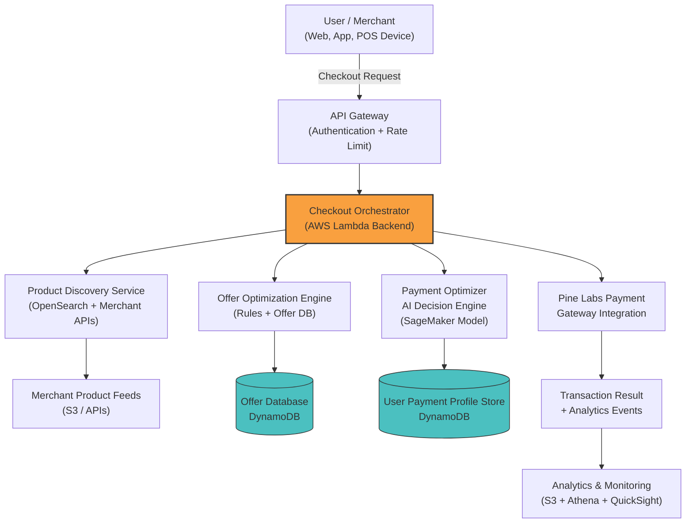

# Intent2Agent Checkout Orchestrator

This repository contains the backend architecture for an AI-driven, intent-based checkout orchestration system. 

It is designed to intelligently route and optimize the checkout experience by combining Product Discovery, Offer Optimization, and Payment Routing into a single, seamless flow via AWS Lambda.

## Core Architecture

The system acts as the central orchestrator that interfaces with merchant applications and delegates targeted operations to specialized microservices.



### Architecture Components:

1. **Client Layer**: Front-facing Web/App or POS devices for merchants.
2. **API Layer**: AWS API Gateway handling authentication and rate limiting.
3. **Orchestrator (This Project)**: An AWS Lambda function (deployed via Docker/ECR) that manages the complete checkout lifecycle.
4. **Sub-Services**:
   - **Product Discovery**: Matches and retrieves accurate product data.
   - **Offer Optimization**: Applies dynamic discounts/rules based on user profiles or cart contents.
   - **Payment Optimizer AI**: Selects the highest-converting or lowest-cost payment method for a specific user using Machine Learning.
5. **Gateway Integration**: Final transaction execution with payment partners like Pine Labs.
6. **Data & Analytics**: Event tracking pipeline logging every step for BI tools (Athena/QuickSight).

## Development & Deployment setup

This project is deployed to AWS via Docker and ECR. 

### Prerequisites
1. Docker
2. AWS CLI configured with appropriate permissions.
3. An ECR Repository created (`my-lambda-backend`).
4. GitHub Actions configured with `AWS_ACCESS_KEY_ID` and `AWS_SECRET_ACCESS_KEY` secrets for CI/CD.

### Manual Deployment
If you need to deploy manually from your local machine, use the included shell script:
```bash
# Ensure AWS variables at the top of the file are correct
./deploy.sh
```

### CI/CD Deployment
This repository is configured to automatically build and deploy new Docker images to AWS Lambda via GitHub Actions whenever changes are pushed to the `main` branch. See `.github/workflows/deploy.yml` for configuration specifics.
